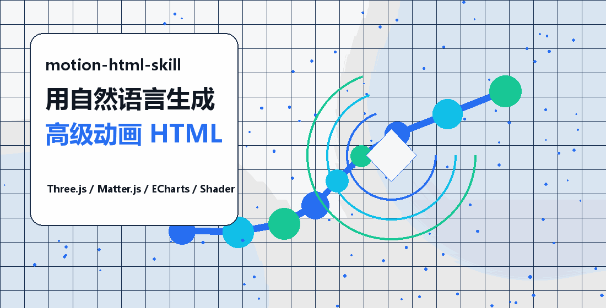
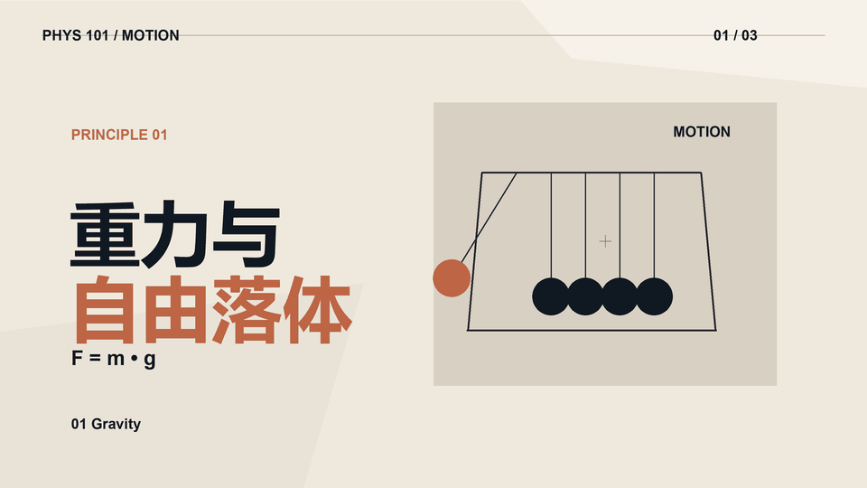
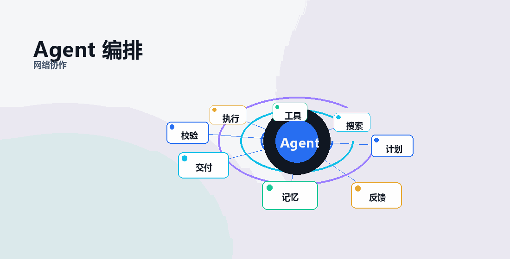

# motion-html-skill

[](./LICENSE)
[](./SKILL.md)
[](https://threejs.org/)
[](https://brm.io/matter-js/)
[](https://echarts.apache.org/)

中文 | [English](./README_EN.md)

**motion-html-skill** 是一个给智能体安装使用的动效网页 Skill。它的目标是让 Agent 根据自然语言描述、图片参考、网页案例或视频片段，生成或复刻出高级动画 HTML 效果。

<p align="center">
  
</p>

**AI 增长 3D 动效**：适合展示技术趋势、能力跃迁、数据增长和课程封面，强调空间轨迹、粒子流与能力曲线。

<p align="center">
  
</p>

**3D 参考融合动效**：模型语言参考科幻设备/飞行器，动效逻辑参考碎片展开、粒子聚合和镜头推进，最终合成为原创可交互 HTML 模块。

<p align="center">
  
</p>

**物理页面动效**：用牛顿摆表达重力、摆动周期与动量传递：小球下落时加速、上升时减速，碰撞后能量从左端传到右端，画面保持扁平单线、无高光无阴影。

<p align="center">
  
</p>

**Agent 编排动效**：适合展示多智能体协作、任务拆解、工具调用、记忆反馈和流程闭环。

<p align="center">
  <a href="./SKILL.md"><strong>Skill 文件</strong></a> ·
  <a href="./references/effect-workflow.md"><strong>动效工作流</strong></a> ·
  <a href="./reference-fusion-demo.html"><strong>3D 融合案例</strong></a> ·
  <a href="./index.html"><strong>演示入口</strong></a> ·
  <a href="./ai-training-html-deck.html"><strong>完整 HTML 案例</strong></a>
</p>

## 它解决什么问题

很多智能体会写 HTML，但做出来常常只是普通页面、淡入动画、简单卡片。这个 Skill 约束智能体按“视觉参考 -> 动效抽象 -> 技术选型 -> 原创实现”的流程工作，让输出更接近可展示、可复刻、可继续修改的高级动效模块。

适合这类需求：

- “根据这段描述做一个 3D AI 发展趋势动画。”
- “参考这个视频 4-9 秒的感觉，做一个原创 HTML 动效。”
- “把这页 PPT 改成可交互网页演示。”
- “做一个可以拖动、带粒子、物理碰撞和阶段展开的模块。”

## 智能体工作流

1. 理解描述：主题、风格、交互、画面中心、输出格式。
2. 联网找参考：复杂效果先看更适配的 3D、WebGL、物理、图表案例。
3. 抽象动效：复刻运动逻辑，不复制受保护画面和素材。
4. 选择技术：Three.js、Matter.js、ECharts、SVG、Canvas、Shader 等。
5. 输出 HTML：优先可运行、可修改、可继续迭代。

## 参考来源建议

这个 Skill 不要求 Agent 局限在本仓库示例里。遇到高级效果时，应主动参考：

| 来源 | 适合参考什么 |
|---|---|
| Three.js Examples | 3D 场景、粒子、后期处理、相机运动 |
| Spline Community | 高级 3D 产品场景、模型组合、拆分合成 |
| Shadertoy | 程序化 shader、噪声、光效、扭曲 |
| ECharts Examples | 动态图表、时间线、网络图、地图数据 |
| Matter.js Examples | 物理碰撞、拖拽、重力、约束 |
| Rive Community | 角色动效、状态机、交互表情 |
| Mapbox Examples | 地图、路径、空间数据叙事 |
| GitHub Examples | 可复用的 Three.js/WebGL/Matter.js 实现 |

## 快速入门（30 秒设置）

运行安装程序：

```bash
npx skills@latest add Zc030201/motion-html-skill
```

按提示选择要安装到哪个智能体。安装完成后，在你的 Agent 中直接这样使用：

```text
使用 $motion-html-skill，参考这个视频片段的运动逻辑，做一个原创 HTML 动效。
```

## 示例提示词

```text
使用 $motion-html-skill，根据这段描述做一个高级 3D AI 增长动画。
```

```text
使用 $motion-html-skill，参考这个视频片段的运动逻辑，做一个原创 HTML 动效。
```

```text
使用 $motion-html-skill，把这页培训内容改成一个可交互网页演示模块。
```

## 仓库内容

```text
motion-html-skill/
  SKILL.md                         # 智能体读取的 Skill 指令
  agents/openai.yaml               # Skill UI 元数据
  references/effect-workflow.md    # 联网参考与复杂动效工作流
  index.html                       # 默认中文演示入口
  reference-fusion-demo.html       # 模型参考 + 动效参考融合案例
  ai-training-html-deck.html       # 完整交互课件案例
  bili-inspired-growth-module.html # 3D 趋势模块案例
  bili-11-15-replica.html          # 视频灵感动效案例
  assets/                          # 示例素材
```

## 许可

MIT。详见 [LICENSE](./LICENSE)。

