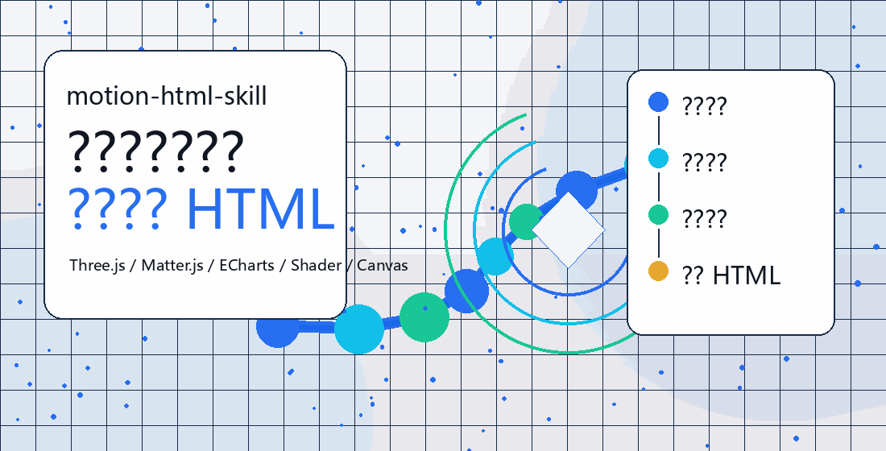

# motion-html-skill

[中文](./README.md) | English

**motion-html-skill** is an installable agent skill for generating premium animated HTML effects from natural-language briefs, reference images, existing web demos, or short video-effect descriptions.



<p align="center">
  <a href="./SKILL.md"><strong>Skill File</strong></a> ·
  <a href="./references/effect-workflow.md"><strong>Effect Workflow</strong></a> ·
  <a href="./index.html"><strong>Demo Entry</strong></a> ·
  <a href="./ai-training-html-deck.html"><strong>HTML Deck Case</strong></a>
</p>

## What It Helps Agents Do

- Create animated HTML modules from a text brief.
- Recreate the motion logic of a reference or video segment as an original effect.
- Search for better 3D/WebGL/physics/chart examples instead of relying only on local demos.
- Combine Three.js, Matter.js, ECharts, SVG, Canvas, and shader-style visuals.
- Produce editable, runnable HTML that can be iterated.

## Recommended Reference Sources

- Three.js examples for 3D scenes, particles, post-processing, and camera motion
- Spline community for polished 3D object composition
- Shadertoy for procedural glow, noise, distortion, and shader surfaces
- ECharts examples for animated charts and data storytelling
- Matter.js examples for physics-based interactions
- Rive community for expressive state-based 2D animation
- Mapbox examples for routes, maps, and spatial data
- GitHub examples for reusable implementation patterns

## Install As A Skill

Copy these files into your agent skill directory:

```text
motion-html-skill/
  SKILL.md
  agents/openai.yaml
  references/effect-workflow.md
```

## Example Prompts

```text
Use $motion-html-skill to create a premium 3D AI growth animation.
```

```text
Use $motion-html-skill to recreate the motion logic of this video segment as an original HTML effect.
```

## License

MIT. See [LICENSE](./LICENSE).

